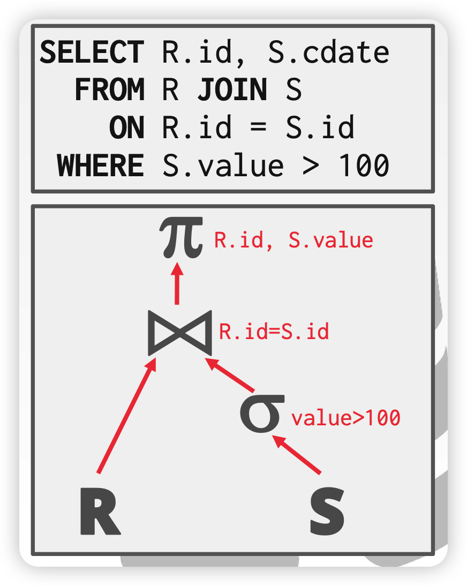

## 简介

[6.830/6.814](http://db.lcs.mit.edu/6.830/)是MIT的关系型数据库入门课程，[SimpleDB](https://github.com/MIT-DB-Class/simple-db-hw-2021)作为课程实验，实现了基础的数据库功能，学生需要实现其中缺少的核心模块。SimpleDB采用Java编写，比另一门数据库名课[CMU 15-445/645](https://15445.courses.cs.cmu.edu/fall2021/)使用Cpp更友好，可以不用总是考虑内存安全的问题；不过Java全部pass by reference也给我造成一点问题，有时候需要考虑传递过去的对象是否会被改变，被改变了是否会对其他位置的reference造成问题。

6.830和CMU 15-445是基本差不多的，CMU 15-445的Andy老师课讲的很好，本人是观看CMU 15-445课程学习一些所需数据库知识，然后做的6.830的实验。从二月初开始，补一些数据库的知识，到三月初断断续续完成了前三个lab；然后前几日下了决心把它做完，每天做一个lab，又花了两天debug，通过最难的那个`BTreeTest`。

## SimpleDB架构

SimpleDB主要包含下列class：

- 表示field，tuple，和tuple schema的类
- 将谓词和筛选条件应用到tuples上的类
- 一个或多个将relation保存在disk上的方法，并提供迭代relation包含的tuples的方法
- 一系列处理tuples的operator（如select，join，insert，delete等）
- buffer pool，用于将活跃的page换存在内存中，并负责处理并发控制和事务
- catalog，保存tables和它们schema信息

lab1中涉及的SimpleDB主要模块如下：

## Exercises

### 1. Fields and Tuples

TupleDesc是table的schema，描述了Table中所有Tuple的格式，Tuple由一到多个Field构成。

完成TupleDesc，Tuple。

### 2. Catalog

全局Catalog是Catalog类的一个单例对象。存储着数据库的元信息。每个table与一个TupleDesc关联，让operator得知table的schema。

修改Catalog类实现添加新表、获取特定表的信息。

### 3. BufferPool

全局BufferPool是Catalog的一个单例对象。负责管理从disk读取的Page，所有operator都要通过BufferPool读写disk上的Page。

BufferPool中最多保存`numPages`个Page。首先需要实现最关键的`BufferPool.getPage()`方法，如果Page已缓存，则直接返回；否则从Catalog中获取对应的数据库文件，读取Page。

###  4&5. HeapFile access method

access method是从按照特定格式组织的disk文件中读取数据库数据的方法。SimpleDB中包含HeapFile和B+Tree两种。前4个lab仅与HeapFile相关

如上图所示，HeapFile分成多个HeapPage，每个Page固定大小，包括header和多个Tuple  slot。header中有一个bitmap，用来表示某个slot是否被使用。HeapPageId用来唯一标识一个HeapPage，记录Page所在表，page序号。RecordId用来唯一标识一个tuple，记录了tuple所在的PageId，和tuple序号。

本实验需要完善HeapPageId，RecordId，HeapPage类。

`BufferPool.getPage()`方法需要调用具体的DbFile来读取page，所以要实现HeapFile中读取page的方法。此外，还要实现`HeapFile.iterator()`方法，用来迭代HeapFile中所有page包含的Tuple。注意：iter中需要使用`BufferPool.getPage()`来读取page，这样对数据库的访问才能被纳入管理； `open()` iter时不要把所有page都load到内存，浪费内存。

### 6. Operators

SimpleDB中的多个operators负责query plan的实际执行，它们实现了关系代数中的运算。在SimpleDB中，operator是基于iterator的，每个iterator都实现了DbIterator接口。

借用CMU 15-445的slide，SimpleDB执行query模型如下图。一个query被组织成operator树，底层operator被传递给上层operator的构造器。最底层叶子结点代表access method，从disk中读取tuple；顶层的operator只需要不断调用`getNext()`，即可输出符合条件的查询结果。顶层的`getNext()`调用会不断向下传递，直到access method，然后读取tuple再向上传递。如果query中只包含简单的数据筛选，如`value > 100`，那么整个query树是可以pipeline化的，数据自底向上源源不断的传递，输出；但是遇上join这种operator，就需要其中一个子节点输出所有tuple后才能继续向上传递。

lab1中只需要先实现一个顺序扫描的operator，它顺序扫描指定的表，读取所有tuples。刚好可以利用上面实现的`HeapFile.iterator()`。
