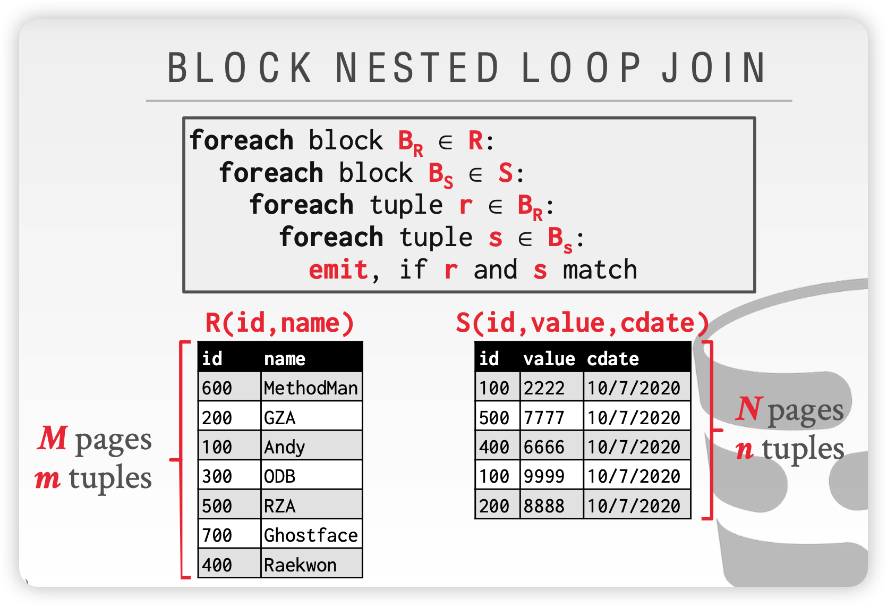
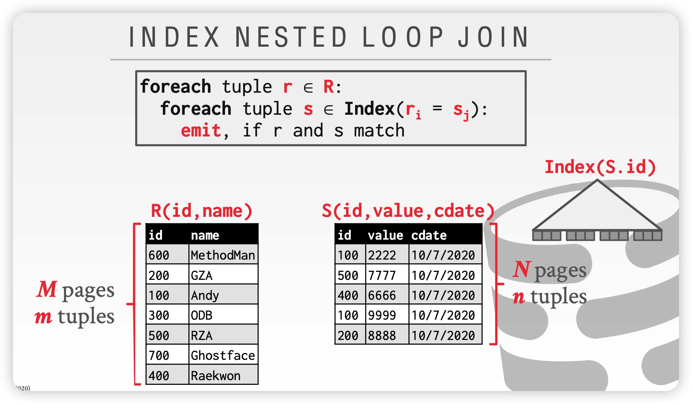
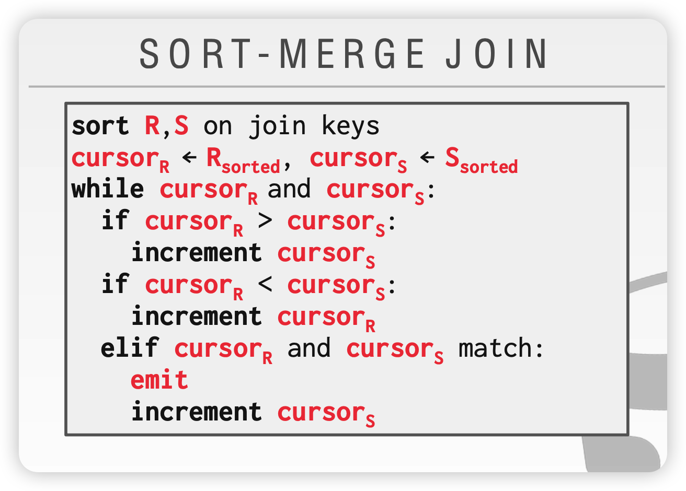
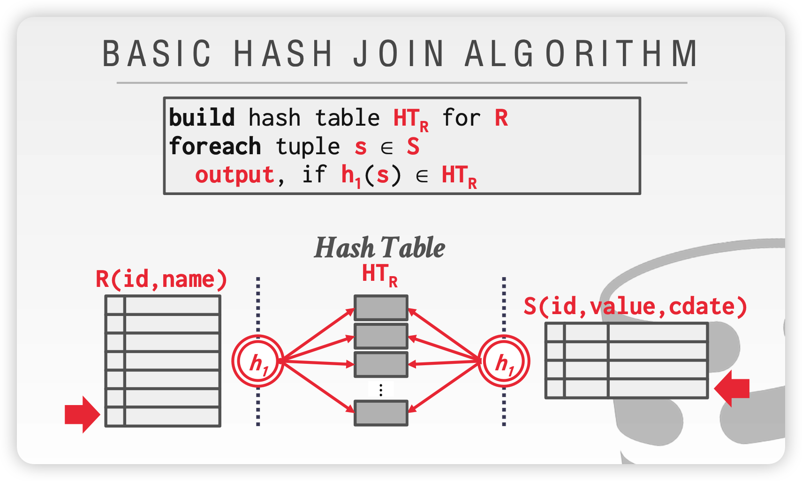

## 简介

lab1中实现了SeqScan operator，它作为后续所有operator读取数据的基础。lab2中将继续实现其他的operator，这样SimpleDB就有了基本的数据存储与查询功能。

## Exercises

### 1. Filter and Join

- Filter

  仅返回满足某个`Predicate`的tuples。`Predicate`类根据被传入的`Tuple`的某个`Field`来判断`Tuple`是否符合要求。

  `Predicate`支持七种类型的筛选条件：`EQUALS`，`GREATER_THAN`, `LESS_THAN`, `LESS_THAN_OR_EQ`, `GREATER_THAN_OR_EQ`, `LIKE`, `NOT_EQUALS`;

- Join

  Join operator使用`JoinPredicate`将两个子operator返回的结果进行join。`JoinPredicate`根据被传入的两个`Tuple`的两个`Field`判断是否满足join条件。

  实现Join可以一般有三种方式（再次借用CMU 15-445的PPT）：

  - NESTED LOOP JOIN

    直接使用双层循环，是最符合直觉的join方式。

    可以使用分块（Page）读取进行优化，即BLOCK NESTED LOOP JOIN，不过其实我们lab1中实现的SeqScan对上层operator是透明的，并且`Page`接口没有定义获取一个Page有多少`Tuple`的方法（`HeapPage`有，但不通用），所以在SimpleDB中不好直接实现。

    

    如果在join key上有index，我们还可以基于index进行优化

    

  - SORT-MERGE JOIN

    算法逻辑如下图，但是根据`JoinPredicate`的不同，有时候需要回溯cursor，例如`s.value < r.value`这种。

    

  - HASH JOIN

    基于Hash的join，非常高效，但是这种方法一般只适用于等值Join。

    

### 2. Aggregates

我们需要实现五种基本聚合函数：`COUNT`, `SUM`, `AVG`, `MIN`, `MAX`，实验中只需要支持对单个`Field`进行group by与聚合。

SimpleDB定义了`Aggregator`接口，上层operator调用其`mergeTupleIntoGroup(Tuple tup)`方法，不断地传入Tuple，`Aggregator`不断更新聚合的状态。这种设计也有利于query执行的pipeline化；`Aggregator`还定义了`iterator()`方法，用于迭代其当前聚合结果。SimpleDB只支持两种数据类型（INT和String），所以需要实现两种对应的`Aggregator`，使用简单的基于hash的方法实现就好。

然后还需要实现`Aggregate` operator，它将子operator输出的Tuples全部传递给`Aggregator`，聚合完成后再向外输出tuples。

### 3. HeapFile Mutability

目前为止，SimpleDB都还是只读的。所以需要实现修改表的方法。

对`deleteTuple`，每个Tuple中都包含RecordId，所以可以确定该Tuple在哪个page，然后删除。

对`insertTuple`，我们需要使用HeapFile中遍历HeapPage，找到有空slot的page，然后插入；如果找不到带有空slot的page，那么就新建一个Page并写入文件。

跟lab1中相同，获取page，一定要通过`BufferPool.getPage()`，这样对page的访问才能被纳入管理，方便后面实现事务。

`insertTuple`和`deleteTuple`这两个mutable的方法，会造成Page的修改，即产生dirty page（修改仅在内存中，未写入disk）。DbFile执行完`deleteTuple`及`insertTuple`后，会返回dirty page，BufferPool需要调用`Page.markDirty()`标记该page，如果page不在BufferPool中，还需要将其加入（明明是通过BufferPool获取的page，为什么可能会不在BufferPool中呢？当然是因为后面的page eviction了）。

### 4. Page eviction

lab1中，当使用page数量超出BufferPool限制，直接抛异常了。这是肯定不行的，所以当BufferPool满了，还要读取新的page时，应当从现有page中淘汰一个，可以选择实现最常见的LRU策略。

