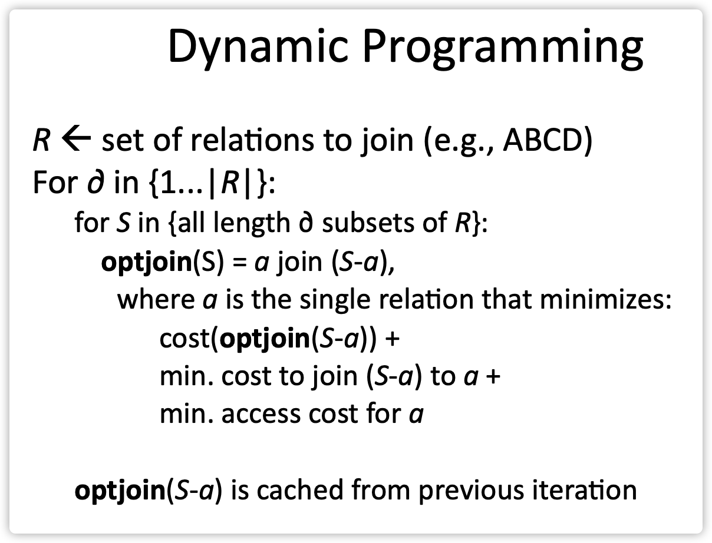

## 简介

在lab2中，实现了SimpleDB中的operator，对operator进行组合，就可以执行查询了，涉及查询，就应当进行查询优化了。lab3中，要实现一个cost-based optimizer。

cost-based optimizer的主要设计如下：

- 使用表的统计信息来评估不同query plan的cost。通常，query plan的cost与intermediate join/selection的基数以及filter/join predicates的selectivity（此处理解为满足predicates的tuple所占比例）有关。
- 使用这些信息将以最优的方式将selection和join排序，并选择最优的算法去实现join。

optimizer的架构如下：

- `Parser`初始化时，构造一个table统计信息的集合（`statsMap`）。然后等待query输入，并对输入的query调用`parseQuery`。
- `parseQuery`首先构造出`LogicalPlan`，然后`parseQuery`调用`LogicalPlan`对象上的`physicalPlan`方法。`physicalPlan`方法返回一个`DBIterator`对象，用于实际执行query。


## Exercises

### 1. Statistics Estimation

准确估计cost是非常tricky的。在本lab中，只关心一系列join以及表访问的cost，无需关系access method的选择（现在也只有scan HeapFile一种）和其他operator的开销（如aggregates）。

#### 1.1 Overall Plan Cost

`p=t1 join t2 join ... tn` 表示一个left deep join，且t1是left-most的，其cost表示为：

```shell
scancost(t1) + scancost(t2) + joincost(t1 join t2) +
scancost(t3) + joincost((t1 join t2) join t3) +
...
```

scancost是I/O开销，joincost是cpu开销，为了两者可以比较

```shell
cost(predicate application) = 1
cost(pageScan) = SCALING_FACTOR x cost(predicate application)
```

本lab忽略缓存的作用（即认为每次访问table的cost都是一次完整scan的cost）。

#### 1.2 Join Cost

nested-loop join的cost如下：

```shell
joincost(t1 join t2) = scancost(t1) + ntups(t1) x scancost(t2) //IO cost
                       + ntups(t1) x ntups(t2)  //CPU cost
```

#### 1.3 Filter Selectivity

需要评估一个table中满足predicate的tuple数量，本lab中采用基于直方图的方案：

- 对每个Field，计算出其最小最大值（scan一次）；
- 对每个属性构造直方图，可以使用固定个数的bucket；
- 再次扫描，填充直方图；
- 对一个`f=const`的查询，其属于的bucket，宽度为w，高度为h（tuple个数），table总tuple数为ntups，那么selectivity是*(h / w) / ntups*。*(h/w)*表示const值在该bucket中的数量的估计值；
- 对于`f>const`查询，找出const所在bucket b，其宽度w_b，高度h_b，b_part = (b_right - const)/w_b，b在整个直方图占比b_f = h_b / ntups，那么b对selectivity的贡献是b_f * b_part。然后再算出b右边所有bucket的selectivity；
- 对于`f<const`，同上。


SimpleDB仅支持Int和String，所以直方图也要实现两种。`StringHistogram`是基于`IntHistogram`的，所以其实只需要实现`IntHistogram`。

然后是实现`TableStats`类，它会计算table的tuple及page的数量，并使用直方图估计估计某些predicate的selectivity。query parser会对query涉及的每个table创建一个TableStats实例，然后将其传递给query optimizer。

#### 1.4 Join Cardinality

评估形如：`joincost((t1 join t2) join t3)`的join plan p的开销。join cardinality的评估，其实比selectivity更难。在本lab中，实现`JoinOptimizer`类，只需基于以下简单规则进行：

- 对于等值join，如果join key中其中一个是主键，那么那么该join产生tuple数量不可能超过另一个非主属性的cardinality；
- 对于等值join，当没有primary key时，很难说。可以用一些很简单的方法（比如返回较大表的cardinality）；
- 对于range scan，仍然很难说。输出的size应该和输入的size成正比。可以假定cross-product的固定比例被输出（例如30%）。一般来说，range join的cost应该大于同样大小的两个表的非主键等值join的cost。


### 2. Join Ordering

实现Selinger优化器。在接下的方法中，join被表达为join nodes（即，2个table上的predicate）的列表，而不是前面class中的用于join的relation的列表。

Selinger算法：只考虑left-deep join。从大小为1的子集开始，不断求出每个子集的最佳join顺序。从size 为i的子集不断扩大到size为 i+1的子集，是一个动态规划方法。



将其转化为如下伪代码：

```pseudocode
1. j = set of join nodes
2. for (i in 1...|j|):
3.     for s in {all length i subsets of j}
4.       bestPlan = {}
5.       for s' in {all length d-1 subsets of s}
6.            subplan = optjoin(s')
7.            plan = best way to join (s-s') to subplan
8.            if (cost(plan) < cost(bestPlan))
9.               bestPlan = plan
10.      optjoin(s) = bestPlan
11. return optjoin(j)
```

这个算法本身不难，并且伪代码中的`subset`、`cost`等功能，SimpleDB都提供给我们了，把伪代码转写为java就OK了。
