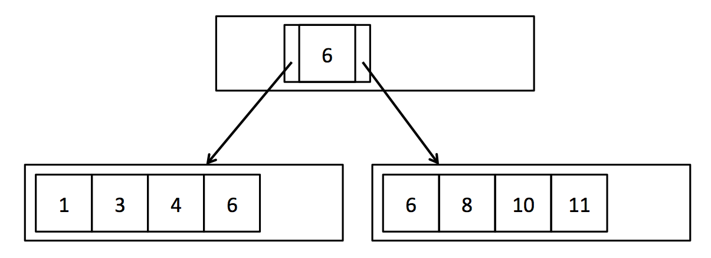

## 简介

实现前4个lab后，SimpleDB已经是一个支持事务和CRUD的简单数据库了，但是性能太低了随便一个点查询或者范围查询，都要扫描整个table对应的DbFile。本lab需要实现一个B+Tree索引，用于快速查找和range scan。SimpleDB提供了实现树所需的所有low-level代码，我们需要自己实现使用树搜索，分裂page，在page间重新分配tuples，合并page的方法。

B+Tree树的叶节点，可以直接包含Tuple，也可以包含Tuple的RecordId，为了简化，本实验的叶节点，直接存储Tuple。

## Exercises

### 1. Search

BTreeFile包含四种不同的page：

首先是`BTreeInternalPage`和`BTreeLeafPage`，`BTreePage`接口包含了对这两种page的抽象；`BTreeHeaderPage`用于追踪哪些page正在被使用；`BTreeRootPtrPage`存在于每个BTreeFile的头部，指向RootPage和第一个HeaderPage。

首先我们需要实现对B+Tree的搜索，对于给定的key，返回其所在的LeafPage；如下图，给key1，应该返回左侧page。

> 需要注意的是，如果给出key6，也应该返回左侧page，否则沿着page查找时，会丢掉左侧这个tuple。

在本实验中，读取page都要使用`BTreeFile.getPage()`，其内部也是调用`BufferPool.getPage()`，但是添加了更多对dirty page的追踪。HeapFile执行insertTuple/deleteTuple时，只会返回一个dirty page，但是B+Tree由于涉及到节点的split/merge，可能会有很多dirty page。

在`findLeafPage()`中，获取的Internal Page都应该是READ_ONLY权限，Leaf Page应该是参数给定的权限。这是B+Tree访问加锁的策略。

### 2. Insert

插入需要首先使用`findLeafPage()`找到对应的Leaf Page，然后可能涉及到Leaf Page的split，split后需要向parent page插入一个新的key，这又可能涉及到parent的split，直到Root Page。

SimpleDB十分喂饭，提供的`getParentWithEmptySlots()`帮我们处理了这个递归过程，我们只需要实现`splitLeafPage()`和`splitInternalPage()`。

如下图所示，split leaf page，是将一个page从中间一分为二，将右侧page第一个key ”copy“到parent中。

split internal page是将page中间的key “push”到parent中，然后将其两边的key一分为二。

注意B+Tree需要时刻保持以下特性：

- 如果parent指向child，那么child必须指回同一个parent；
- 如果一个leaf指向一个right sibling，那么right sibling必须将它作为left sibling；
- 第一个和最后一个Leaf，对应sibling必须指向null；
- RecordId必须与page匹配；
- child为non-leaf节点的key，必须比left child的key大，比right child的key小；
- child为leaf节点的key，必须大于等于left child的key，小于等于right child的key；
- 一个节点的child，要么都是non-leaf，要么都是leaf。

如果测试中出现了错误，可以使用SimpleDB提供的`BTreeChecker`，检查是否满足上述特性。

### 3. Delete

删除Tuple可以使用RecordId直接给对应的Leaf Page加锁，然后删除；删除后如果Leaf Page的Tuple数量少于半满，可能会有两种情况。

如果sibling多于半满，那么可以从sibling steal一定数量的tuple，使得两者平均，steal后，还需要修改parent entry中的key。

如果sibling也少于等于半满，那么需要和sibling merge，并且删除parent中的entry，而对parent中的entry进行删除，则可能会触发parent的递归steal或者merge。

### 4. Transactions

如果想要允许多线程同时访问B+Tree，要防止以下两种问题：

- 多个thread同时修改一个node的内容；
- 一个thread正在traversing tree，其他线程在merge/split node。

SimpleDB中的加锁策略很简单：

- 对于scan，从root page到leaf page，加读锁；
- 对于insert，从root page开始的所有internal page都加读锁，Leaf page加写锁，如果涉及到split，就对sibling和parent加写锁，并且继续递归向上加写锁；
- 对于delete，直接对leaf page加写锁，如果涉及到steal/merge，再对sibling和parent加写锁，并且继续递归向上加写锁处理。

CMU 15-445中讲解了一些更好的加锁方法：

如果前面对于lab4 transaction和B+Tree的实现都正确，那么我们的B+Tree应该是自动满足事务的。`BTreeTest`是整个SimpleDB最难的测试，并发量比较大，对事务和B+Tree的问题基本都能测试出来。如果测试出了错误，可以使用`BTreeChecker`来检查B+Tree在并发时有无格式错误；可以先将测试用例的并发度降到能复现错误的最低值，然后输出执行过程过的加锁、commit、abort、split/merge page等信息，一点一点模拟，花个一两天总能debug出来。
