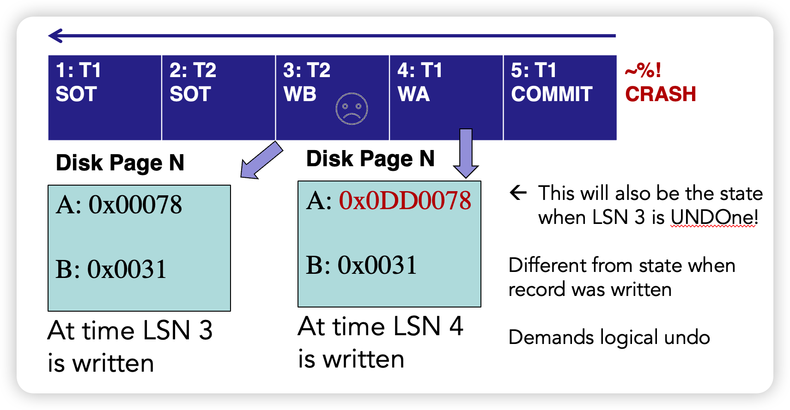
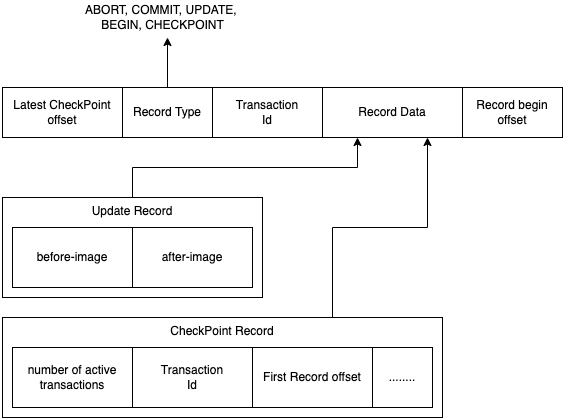

## 简介

在lab4中，我们实现的事务是基于NO STEAL/FORCE的，no steal会影响BufferPool的可用空间，甚至如果事务的write set太大了，BufferPool太大了，事务会根本无法执行；Force会导致I/O的开销特别大，并且commit前写多个page时可能会crash，无法保证原子性。所以要做基于WAL的Rollback和Recovery。

Recovery算法包含两部分：

- 为了确保DBMS能够从failure中恢复，在事务的正常执行过程中需要做的事；

  在事务执行中，写入WAL。仅当事务对应的log都被持久化之后，才能提交事务；当事务abort后，可以利用WAL log回滚。定期向持久化存储写入checkpoint，记录当前活跃的transactions和dirty pages。

  WAL包含redo和undo信息：

  - redo log必须是physical的，如对DB内某数据结构的修改，因为crash时，DBMS可能不满足“action consistent”，一些操作可能包含一系列非原子操作，例如插入一条数据，index中插入了，但是HeapFile中还没有。

  - undo log必须时logical的，如delete/insert一条DB中的Tuple，因为当我们undo时，状态可能和写入该log时不一致了。如下图，undo T2时，如果把Page N直接恢复到WB之前的状态，那T1的修改就丢失了。

    

  

- 当DBMS crash后，需要做一些操作来恢复数据库的状态，保证ACD（隔离是2PL/MVCC的事了）。

  - 从最近checkpoint开始分析，得出需要redo和undo的事务列表
  - redo
  - undo

SimpleDB提供的日志代码产生的日志记录用于进行physical的全页undo和redo。当一个page第一次被读入时，代码会记录该页面的原始内容，作为一个before-image。当一个事务更新过一个page后，对应的日志record，会将记录的修改前的page内容作为before-image，将修改后的当前page内容作为after-image。之后，可以使用before-image在abort时回滚，或者在Recovery期间撤销loser transactions；使用after-image在Recovery期间redo winner transactions。

之所以可以通过整个页面的physical UNDO来完成abort和恢复，是因为SimpleDB使用页级锁并且没有那种可能在undo时与日志被写入时结构不一致的索引。页级锁的简化作用是：如果一个事务修改了一个Page，它一定有该Page的独占锁，这意味着没有其他事务在同时修改它，所以我们可以通过覆盖整个页面来UNDO对它的修改，也就是下图中，T2 commit前，T1没有机会写Page N，physical undo不会覆盖其他事务的修改。

SimpleDB日志的格式如下图所示：

## Exercises

### 1. Rollback

SimpleDB提供了数据结构`tidToFirstLogRecord`来保存每个事务在logfile里的offset。我们只需要从开始处一直读，保存每个page的before image，然后将所有before image写回disk，即可完成rollback。

### 2. Recovery

如果数据库crash并且重启，那么会在开始执行事务之前，先调用`LogFile.recover()`进行恢复。

- 如果有，读取最新的checkpoint；
- 从checkpoint向后扫描，找出loser transaction（checkpoint中记录的active tx，但后续未commit的；checkpoint后开始的新tx，但未commit的），redo checkpoint后更新记录。因为调用`LogFile.logCheckpoint()`会把所有dirty page写入disk，所以可以安全的从ckeckpoint开始redo；
- undo loser transactions；
- SimpleDB中，abort的事务不要redo，也不要undo。

